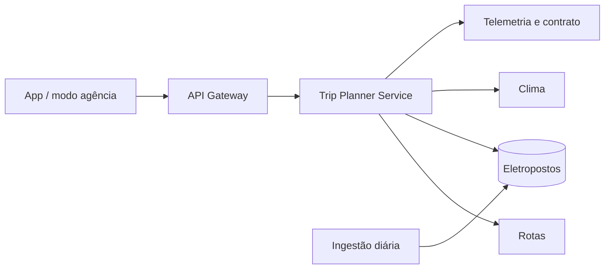

#  Trip Plan
**Análise de requisitos · app Integração com o App de Assinatura**

## Objetivo

Permitir que clientes e atendentes simulem viagens longas com carros elétricos e recebam um plano com paradas de recarga, carga ao chegar e sair de cada parada, tempo de recarga e horário de chegada.

**Fora do escopo:** navegação própria, reserva e pagamento de recarga, disponibilidade em tempo real.

## Requisitos funcionais

| ID | Requisito | Fase |
|---|---|:---:|
| RF01 | Informar origem e destino da viagem | 1 |
| RF02 | Calcular rota e consumo considerando relevo, velocidade e temperatura | 1 |
| RF03 | Definir paradas com carga de chegada, carga de saída e tempo de recarga | 1 |
| RF04 | Indicar um eletroposto alternativo (plano B) para cada parada | 1 |
| RF05 | Informar quando não há plano viável e em qual trecho | 1 |
| RF06 | Modo agência: simular com qualquer modelo da frota, sem login do cliente | 2 |
| RF07 | Abrir a rota no Google Maps ou no Waze | 3 |
| RF08 | Mostrar quanto da franquia de km a viagem consome | 3 |
| RF09 | Ler a carga da bateria pela telemetria da Localiza | 3 |
| RF10 | Recalcular o plano durante a viagem com a carga real | 4 |

## Regras de negócio

- Chegar a cada parada e ao destino com no mínimo **15%** de carga.
- Carregar só o necessário até a próxima parada, **limitado a 80%**.
- Usar apenas eletropostos compatíveis, com **40 kW** ou mais e a até **5 km** da rota.
- Aplicar **10%** de margem de segurança sobre o consumo estimado.
- No app, usar a carga lida pela telemetria; no modo agência, considerar carga inicial de **100%**.

## Requisitos não funcionais

- Gerar o plano em até **5 s**.
- Atualizar a base de eletropostos **diariamente**.
- Seguir a **LGPD**, com consentimento do cliente para uso dos dados de telemetria.
- Continuar funcionando se um provedor externo falhar.

## Integrações

| Dado | Fonte | Custo |
|---|---|---|
| Rota e altitude | [OpenRouteService](https://openrouteservice.org) | Grátis (2.000 rotas/dia) |
| Eletropostos | [Open Charge Map](https://openchargemap.org) + OpenStreetMap | Grátis |
| Clima | [Open-Meteo](https://open-meteo.com) | Grátis (uso não comercial) |
| Ficha dos veículos | [Open EV Data](https://github.com/KilowattApp/open-ev-data) | Grátis |
| Carga da bateria (telemetria) e contrato | Sistemas Localiza | Interno |

## Arquitetura

## Principal risco

As bases abertas de eletropostos podem estar desatualizadas e não informam se o carregador está livre. Mitigação: plano B em toda parada, reserva mínima de 15% e ingestão diária dos dados.

## Cronograma

| Fase | Semanas | Entregas |
|---|:---:|---|
| 1. Fundação | 1–4 | Rotas, consumo, eletropostos e escolha de paradas |
| 2. Modo agência | 5–7 | Tela do atendente e teste em agências |
| 3. App do cliente | 8–13 | Integração no app, telemetria da bateria, navegação e franquia |
| 4. Recálculo e ML | 14–23 | Recálculo em viagem e modelo de consumo treinado com a telemetria da frota |
